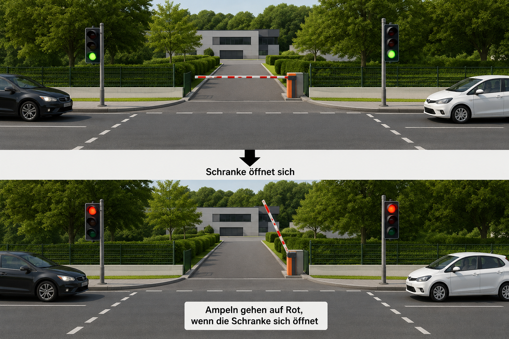
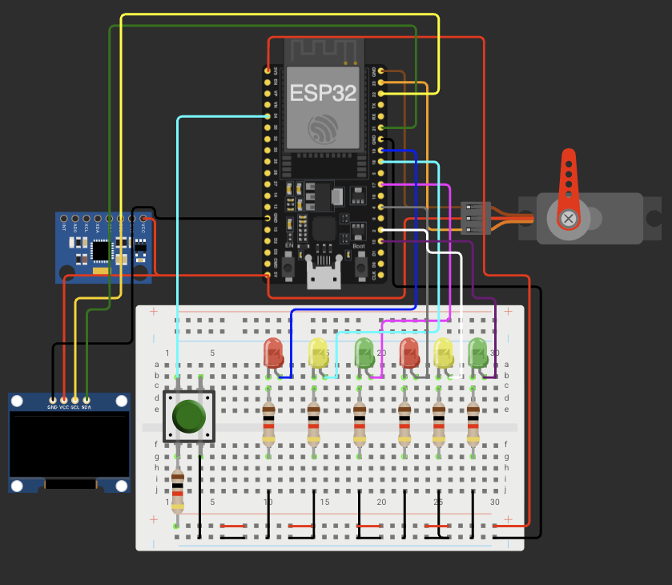
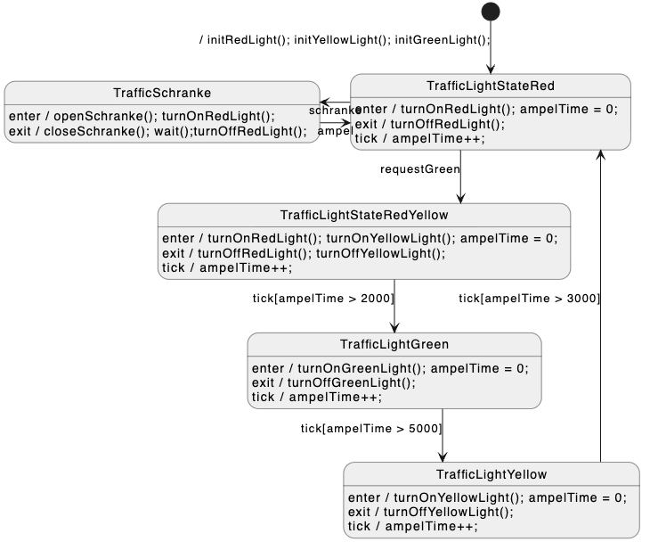

# Schrankensystem via MQTT

Dies ist ein kleines IOT Projekt, das mittels MQTT ein Ampelsystem mit einer Schranke ansteuert.
Es enthält zwei Ampeln, welche auf Rot geschaltet werden, sobald die Schranke geöffnet werden soll.
Anfordern kann man dies über MQTT oder mit einem Button.

##  Hardwareaufbau:

### Hardware:
-   ESP32 Microcontroller
-   ESP32 Servo Motor
-   SSD1306 OLED Display
-   MPU6050 Beschleunigungssensor/Gyroskop
-   2x Rote LED
-   2x Gelbe LED
-   2x Grüne LED
-   1x Button
-   7x 1k Ohm Widerstand

### Verwendete Bibliotheken:

-   Arduino.h
-   PubSubClient.h
-   SPI.h
-   Wire.h
-   WiFi.h
-   Adafruit_GFX.h
-   Adafruit_SSD1306.h
-   Adafruit_Sensor.h
-   Adafruit_MPU6050.h
-   ESP32Servo.h

##  Funktionsweise

Das State-Diagramm zeigt die Funktionsweise der Ampel. Mittels des Diagramms und [StateSmith](https://github.com/StateSmith/StateSmith) wurde der Code für die Automatenzustände der Ampel generiert.

Über MQTT kann das Öffnen der Schranke angefordert werden.
Dann wird in den State TrafficLightStateRed gewechselt, die Ampeln sind dann auf Rot und die Schranke wird geöffnet.
Per MQTT kann diese dann auch wieder geschlossen werden und die Ampel schaltet wieder auf grün.

####    Pinbelegung ESP32

|   Pin     |       Ort         |
|-----------|-------------------|
|   19      |   Rote LED Ampel 1    |
|   4       |   Rote LED Ampel 2    |
|   18      |   Gelbe LED Ampel 1   |
|   2       |   Gelbe LED Ampel 2   |
|   17      |   Grüne LED Ampel 1   |
|   15      |   Grüne LED Ampel 2   |
|   34      |   Button              |
|   21      |   SDA I2C             |
|   22      |   SCL I2C             |
|   23      |   ServoMotor PWM      |

##  MQTT
Als MQTT-Broker wurde zum Testen der öffentliche Broker von [HiveMQ](https://www.hivemq.com/mqtt/public-mqtt-broker/) benutzt.

